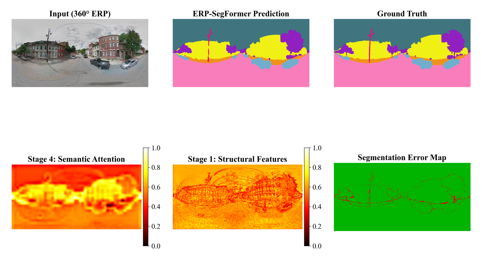
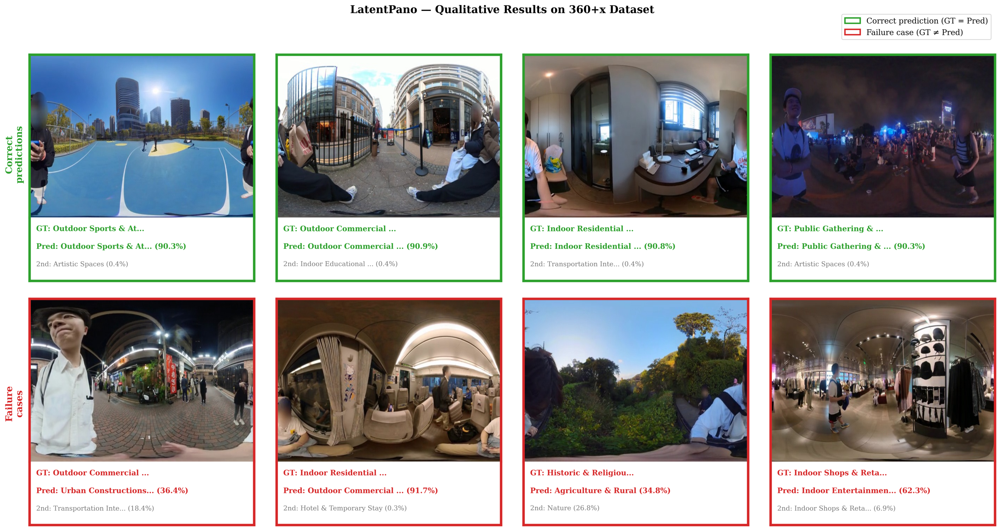
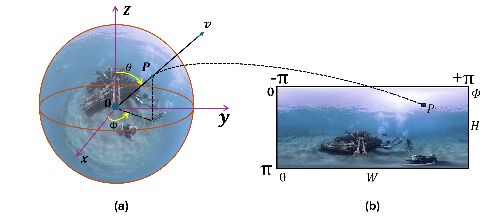
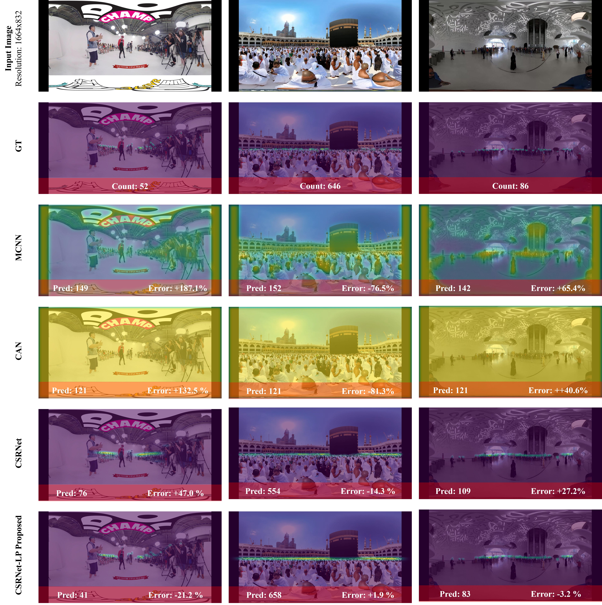

<h1 align="center">Hi 👋, I'm Arbi</h1>
<h3 align="center">From Pixels to Insights: Deep Learning and Image Processing Projects</h3>

  

  

- 🔭 I'm currently working on **Panoramic Vision & Remote Sensing Segmentation**

- 🌱 I'm currently learning **汉语, 广东话, IELTS**

- 👯 I'm looking to collaborate on **360° Style Transfer & Panoramic Vision**

- 💬 Ask me about **Deep Learning, Attention Mechanisms, 360° Videos & ERP Segmentation**

- 📫 How to reach me **arbi at the rate of mail.ustc.edu.cn**

- ⚡ Fun fact **I believe that pixels have personalities – each image tells a unique story waiting to be unveiled by the keen eye of a curious coder.**

---

## 🔬 Research Highlights

I'm focused on **equirectangular projection (ERP) segmentation** and **remote sensing image understanding**, with emphasis on attention mechanisms and specialized architectures for 360° and satellite imagery.

### 🌊 **PanoDive360: Underwater 360° Semantic Segmentation**
Introduces a novel underwater ERP dataset with enhanced attention mechanisms for multiclass segmentation. Maintains spatial coherence across the panoramic domain while handling extreme distortions near poles.

---

### 🗺️ **ERP-Transformer: Outdoor Panoramic Segmentation**
Adapts SegFormer backbone with squeeze-and-excitation channel recalibration for outdoor scenes. Visualizes structural features and semantic attention maps across 360° imagery.

---

### 👥 **LatentPano: 360° Scene Classification**
Addresses panoramic scene classification across indoor/outdoor/commercial environments. Proposes latitude-aware spatial transformation to normalize ERP distortions for robust multi-category predictions.

---

### 🛰️ **SA-RSRefSeg: Scale-Aware Referring Remote Sensing**
Segments remote sensing objects described in natural language. Introduces scale-aware attention prompting for high-resolution aerial imagery with objects at vastly different spatial scales.

---

### 🚁 **Detect-Then-Segment: Space Target Perception**
Unified two-stage pipeline for detecting and segmenting non-cooperative space objects (satellites, spacecraft). Compares single-stage baseline against attention-driven detection-then-segment approach.

---

### 🌍 **Text-Steered Modality Routing: SAR-Optical Fusion**
Annotation-free fusion of Synthetic Aperture Radar (SAR) and optical RGB for land-cover segmentation. Language models guide modality emphasis per region, enabling zero-shot cross-modal learning.

---

### 🎯 **Beyond Perspective: Panoramic Crowd Counting**
Extends crowd counting to 360° panoramic domains. Proposes latitude-aware density maps to account for ERP distortion in immersive video surveillance scenarios.

---

## 🔑 Key Methods Across All Projects

- **Latitude-Aware Sinusoidal Weighting**: ERP pole distortion correction via `sin(πv/H)`
- **Attention Mechanisms**: CBAM, Squeeze-and-Excitation modules for channel recalibration
- **Circular Padding**: Horizontal wrapping for panoramic continuity
- **Domain Adaptation**: Transfer learning across ERP, SAR-optical, and remote sensing domains

---

<h3 align="left">Connect with me:</h3>

<h3 align="left">Languages and Tools:</h3>

                         

---

